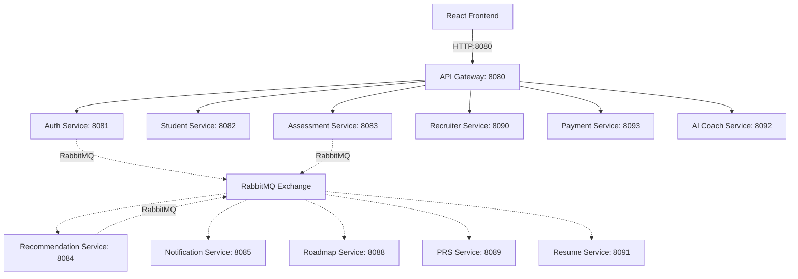

# 🎓 CareerBridge 2.0

> An agentic, microservice-driven career readiness and placement acceleration platform built using Java 21, Spring Boot 4.1.0, RabbitMQ, PostgreSQL, MongoDB, and React (Vite).

---

## 🏗️ System Architecture

CareerBridge is designed around a decoupled, event-driven microservices architecture. The system consists of **11 Spring Boot services** that communicate asynchronously via a shared RabbitMQ exchange, backed by relational (PostgreSQL) and document (MongoDB) databases, and integrated through a central API Gateway.



### 1. Service Breakdown

| Service | Directory | Port | Datastore | Responsibility |
| :--- | :--- | :--- | :--- | :--- |
| **API Gateway** | `api-gateway/` | `8080` | None | Single entry point. Validates JWT signatures, injects `X-User-Id` / `X-User-Role` headers, and aggregates OpenAPI/Swagger documentations. |
| **Auth Service** | `auth-service/` | `8081` | PostgreSQL `careerbridge_auth` | User account registration, login verification, token signing, and role assignments (`SUPER_ADMIN`, `ORG_ADMIN`, `STUDENT`, `RECRUITER`). |
| **Student Service** | `student-service/` | `8082` | PostgreSQL `careerbridge_student` | Manages student profiles containing education records, verified skills, custom projects, and certificates. |
| **Assessment Service** | `assessment-service/` | `8083` | PostgreSQL `careerbridge_assessment` | Manages the skill assessment question bank, user attempts, scoring logic, and category thresholds. |
| **Recommendation Service** | `recommendation-service/` | `8084` | PostgreSQL `careerbridge_recommendation` | Analyzes assessment results, ranks matching career tracks, and recommends personalized career paths. |
| **Notification Service** | `notification-service/` | `8085` | PostgreSQL + MongoDB (Atlas) | Tracks contacts (Postgres) and handles real-time in-app notification feeds (Mongo) and SMTP transactional email alerts. |
| **Organization Service** | `organization-service/` | `8087` | PostgreSQL `careerbridge_organization` | Handles multi-tenant educational institutions, departments, and organization-scoped administrative setups. |
| **Roadmap Service** | `roadmap-service/` | `8088` | PostgreSQL `careerbridge_roadmap` | Creates milestone-driven career roadmaps for students based on their recommended career paths. |
| **PRS Service** | `prs-service/` | `8089` | PostgreSQL `careerbridge_prs` | Tracks the Placement Readiness Score (PRS) - a composite score derived from Assessment (40%), Roadmap (30%), Profile (20%), and Resume (10%). |
| **Recruiter Service** | `recruiter-service/` | `8090` | PostgreSQL `careerbridge_recruiter` | Facilitates job postings, student job applications, interview scheduling, placement tracking, and recruitment analytics. |
| **Resume Service** | `resume-service/` | `8091` | PostgreSQL `careerbridge_resume` | Custom resume generator. Matches profiles against industry keywords (ATS score), packages content into downloadable A4 PDFs, and saves generated data. |
| **AI Coach Service** | `ai-coach-service/` | `8092` | MongoDB Atlas `careerbridge_ai_coach` | An interactive career coaching assistant utilizing Groq Llama3 models, Tavily Search, and YouTube video learning recommendations. |
| **Payment Service** | `payment-service/` | `8093` | PostgreSQL `careerbridge_payment` | Integrates Razorpay payment flows to manage subscriptions, verify payment signatures, and activate CareerBridge Plus tiers. |

---

## ⚡ Asynchronous Event Flow (RabbitMQ)

The system uses a single Topic Exchange (`careerbridge.exchange`) for decoupled, asynchronous inter-service notifications:

### 1. Events Ledger

| Event Name | Routing Key | Publishing Service | Consumed By Services |
| :--- | :--- | :--- | :--- |
| `StudentRegisteredEvent` | `student.registered` | `auth-service` | `student-service` (scaffolds profile), `notification-service` (saves contact), `prs-service` (initializes scoring) |
| `AssessmentCompletedEvent`| `assessment.completed` | `assessment-service` | `recommendation-service` (starts career matching) |
| `RecommendationGeneratedEvent`| `recommendation.generated` | `recommendation-service` | `notification-service` (email alert), `roadmap-service` (creates roadmap), `prs-service` (adds assessment weight) |
| `RoadmapUpdatedEvent` | `roadmap.updated` | `roadmap-service` | `prs-service` (updates roadmap completion weight) |
| `ResumeGeneratedEvent` | `resume.generated` | `resume-service` | `prs-service` (unlocks resume weight), `student-service` (sets resume download URL) |
| `SubscriptionActivatedEvent`| `subscription.activated` | `payment-service` | `auth-service` (activates Premium tier / updates user JWT claims) |
| `OrganizationCreatedEvent`| `organization.created` | `organization-service` | Unconsumed (ready for future service hooks) |
| `ApplicationSubmittedEvent`| `application.submitted` | `recruiter-service` | Unconsumed (ready for future notification triggers) |
| `PlacementCompletedEvent` | `placement.completed` | `recruiter-service` | Unconsumed (ready for future statistics aggregates) |

### 2. Queue Configuration

* **Topic Exchange:** `careerbridge.exchange`
* **Queue Bindings:**
  * `careerbridge.student.queue` ➡️ `student.registered`
  * `careerbridge.student.resume.queue` ➡️ `resume.generated`
  * `careerbridge.recommendation.queue` ➡️ `assessment.completed`
  * `careerbridge.notification.queue` ➡️ `recommendation.generated`
  * `careerbridge.notification.student.queue` ➡️ `student.registered`
  * `careerbridge.roadmap.queue` ➡️ `recommendation.generated`
  * `careerbridge.prs.user.queue` ➡️ `student.registered`
  * `careerbridge.prs.recommendation.queue` ➡️ `recommendation.generated`
  * `careerbridge.prs.roadmap.queue` ➡️ `roadmap.updated`
  * `careerbridge.prs.resume.queue` ➡️ `resume.generated`
  * `careerbridge.auth.subscription.queue` ➡️ `subscription.activated`

---

## 🛠️ Requirements & Prerequisites

Ensure the following tools are installed on your system before proceeding:

1. **Java Development Kit (JDK):** Version 21 (LTS).
2. **Node.js & npm:** Node 18+ (React 19 Frontend utilizes Vite).
3. **Docker Desktop:** Required to spin up containers for PostgreSQL, RabbitMQ, and backend microservices.
4. **MongoDB Atlas Cluster:** Required for `notification-service` and `ai-coach-service`.
5. **SMTP Configuration:** A Gmail account with **App Passwords** enabled (standard email passwords will fail to authenticate).

---

## 🚀 Setup & Launch Instructions

### Option A: Complete Docker Compose Run (Recommended)

1. Create a `.env` file at the root of the project using `.env.example` as a reference:
   ```bash
   cp .env.example .env
   ```
2. Open `.env` and fill in your real configurations:
   * Set `POSTGRES_PASSWORD` and `RABBITMQ_PASSWORD`.
   * Provide your MongoDB connection string in `MONGODB_URI`.
   * Configure Gmail SMTP settings in `GMAIL_USERNAME` and `GMAIL_APP_PASSWORD`.
   * Set external API keys (`GROQ_API_KEY`, `TAVILY_API_KEY`, `YOUTUBE_API_KEY`, and Razorpay keys).
3. Spin up the entire infrastructure and microservices stack:
   ```bash
   docker compose --env-file .env up -d --build
   ```
4. Check running containers:
   ```bash
   docker compose ps
   ```

### Option B: Local Running (For Development & Debugging)

To run services locally on your host machine, you will need a running PostgreSQL server and RabbitMQ broker on localhost.

#### 1. Setup Databases
Connect to your local PostgreSQL server and create the required databases manually:
```sql
CREATE DATABASE careerbridge_auth;
CREATE DATABASE careerbridge_student;
CREATE DATABASE careerbridge_assessment;
CREATE DATABASE careerbridge_recommendation;
CREATE DATABASE careerbridge_notification;
CREATE DATABASE careerbridge_organization;
CREATE DATABASE careerbridge_roadmap;
CREATE DATABASE careerbridge_prs;
CREATE DATABASE careerbridge_recruiter;
CREATE DATABASE careerbridge_resume;
CREATE DATABASE careerbridge_payment;
```

#### 2. Run RabbitMQ
Ensure RabbitMQ is running locally on port `5672` (and management plugin on `15672`).

#### 3. Run Backend Services (Repeat for each folder under `d:\Software\CareerBridge_2.0\`)
1. Navigate to the desired service directory (e.g., `auth-service`):
   ```bash
   cd auth-service
   ```
2. Build the project:
   ```bash
   ./mvnw clean install
   ```
3. Run the Spring Boot application:
   ```bash
   ./mvnw spring-boot:run
   ```

#### 4. Run Frontend React Web App
1. Navigate to the frontend directory:
   ```bash
   cd careerbridge-frontend
   ```
2. Install dependencies:
   ```bash
   npm install
   ```
3. Create a local `.env` file in the frontend folder pointing to your API Gateway:
   ```env
   VITE_API_BASE_URL=http://localhost:8080/api
   ```
4. Start the Vite dev server:
   ```bash
   npm run dev
   ```
5. Open your browser and navigate to `http://localhost:5173`.

---

## 📘 API Documentation (Swagger & OpenAPI)

The system automatically hosts individual and aggregated Swagger API docs. 

* **Aggregated Swagger Dashboard:** **[http://localhost:8080/swagger-ui.html](http://localhost:8080/swagger-ui.html)**
  *(Allows selecting any backend service from the top-right dropdown to view and test its endpoints directly through the API Gateway)*

### Direct Endpoints (Host/Dev mode):

| Service | Swagger Documentation URL | OpenAPI Spec JSON |
| :--- | :--- | :--- |
| **API Gateway** | [http://localhost:8080/swagger-ui.html](http://localhost:8080/swagger-ui.html) | [http://localhost:8080/api-docs](http://localhost:8080/api-docs) |
| **Auth Service** | [http://localhost:8081/swagger-ui.html](http://localhost:8081/swagger-ui.html) | [http://localhost:8081/api-docs](http://localhost:8081/api-docs) |
| **Student Service** | [http://localhost:8082/swagger-ui.html](http://localhost:8082/swagger-ui.html) | [http://localhost:8082/api-docs](http://localhost:8082/api-docs) |
| **Assessment Service**| [http://localhost:8083/swagger-ui.html](http://localhost:8083/swagger-ui.html) | [http://localhost:8083/api-docs](http://localhost:8083/api-docs) |
| **Recommendation Service**| [http://localhost:8084/swagger-ui.html](http://localhost:8084/swagger-ui.html) | [http://localhost:8084/api-docs](http://localhost:8084/api-docs) |
| **Notification Service**| [http://localhost:8085/swagger-ui.html](http://localhost:8085/swagger-ui.html) | [http://localhost:8085/api-docs](http://localhost:8085/api-docs) |
| **Organization Service**| [http://localhost:8087/swagger-ui.html](http://localhost:8087/swagger-ui.html) | [http://localhost:8087/api-docs](http://localhost:8087/api-docs) |
| **Roadmap Service** | [http://localhost:8088/swagger-ui.html](http://localhost:8088/swagger-ui.html) | [http://localhost:8088/api-docs](http://localhost:8088/api-docs) |
| **PRS Service** | [http://localhost:8089/swagger-ui.html](http://localhost:8089/swagger-ui.html) | [http://localhost:8089/api-docs](http://localhost:8089/api-docs) |
| **Recruiter Service** | [http://localhost:8090/swagger-ui.html](http://localhost:8090/swagger-ui.html) | [http://localhost:8090/api-docs](http://localhost:8090/api-docs) |
| **Resume Service** | [http://localhost:8091/swagger-ui.html](http://localhost:8091/swagger-ui.html) | [http://localhost:8091/api-docs](http://localhost:8091/api-docs) |
| **AI Coach Service** | [http://localhost:8092/swagger-ui.html](http://localhost:8092/swagger-ui.html) | [http://localhost:8092/api-docs](http://localhost:8092/api-docs) |
| **Payment Service** | [http://localhost:8093/swagger-ui.html](http://localhost:8093/swagger-ui.html) | [http://localhost:8093/api-docs](http://localhost:8093/api-docs) |

---

## 🛠️ Development & Command Reference

### Backend Maven Commands
Run these from inside a specific microservice directory:

```bash
# Build the package (and install dependencies)
./mvnw clean install

# Launch local Spring Boot development server
./mvnw spring-boot:run

# Run all JUnit 5 test classes
./mvnw test

# Compile and package into a JAR while skipping test executions
./mvnw clean package -DskipTests
```
*(On Windows environments without a Bash shell, use `mvnw.cmd` instead of `./mvnw`)*

### Frontend npm Commands
Run these from inside the `careerbridge-frontend` directory:

```bash
# Install NPM dependencies
npm install

# Start Vite hot-reloading development server
npm run dev

# Bundle production-ready assets
npm run build

# Run Oxlint checker for static code analysis
npm run lint
```

---

## ⚠️ Important Configuration & Troubleshooting Notes

1. **PostgreSQL Connection Pool Exhaustion:**
   * When running the complete 11-service stack, each service spins up HikariCP connection pools (defaulting to 10 connections each). This can easily exceed default Postgres limits.
   * Make sure your PostgreSQL server configuration includes `max_connections = 300` (this is pre-configured in our Docker Compose postgres service).
2. **MongoDB Atlas Health Check 503 Errors:**
   * In `notification-service`, standard Spring Boot Actuator health checks probe the Mongo cluster using a query directed to the `local` database. Because MongoDB Atlas locks down access to the `local` replica state (even for `atlasAdmin` users), Actuator might report a `503 Service Unavailable`.
   * To prevent false-positives, the Mongo health indicator is turned off in Actuator configuration: `management.health.mongodb.enabled: false`.
3. **Idempotent Data Seeding:**
   * `assessment-service` uses `data.sql` to seed questions. If you modify database values, make sure unique constraints are satisfied; otherwise, duplicate boot errors will occur on subsequent launches.
4. **Spring Cloud Gateway Collections Override Trap:**
   * Do not override a gateway route's URI directly using index environment variables (e.g. `SPRING_CLOUD_GATEWAY_SERVER_WEBMVC_ROUTES_0_URI`). Doing so tells Spring's collection binder to ignore the YAML file's route definitions, leading to a silent `404 Not Found` for all matching paths. Use configuration placeholders instead.
